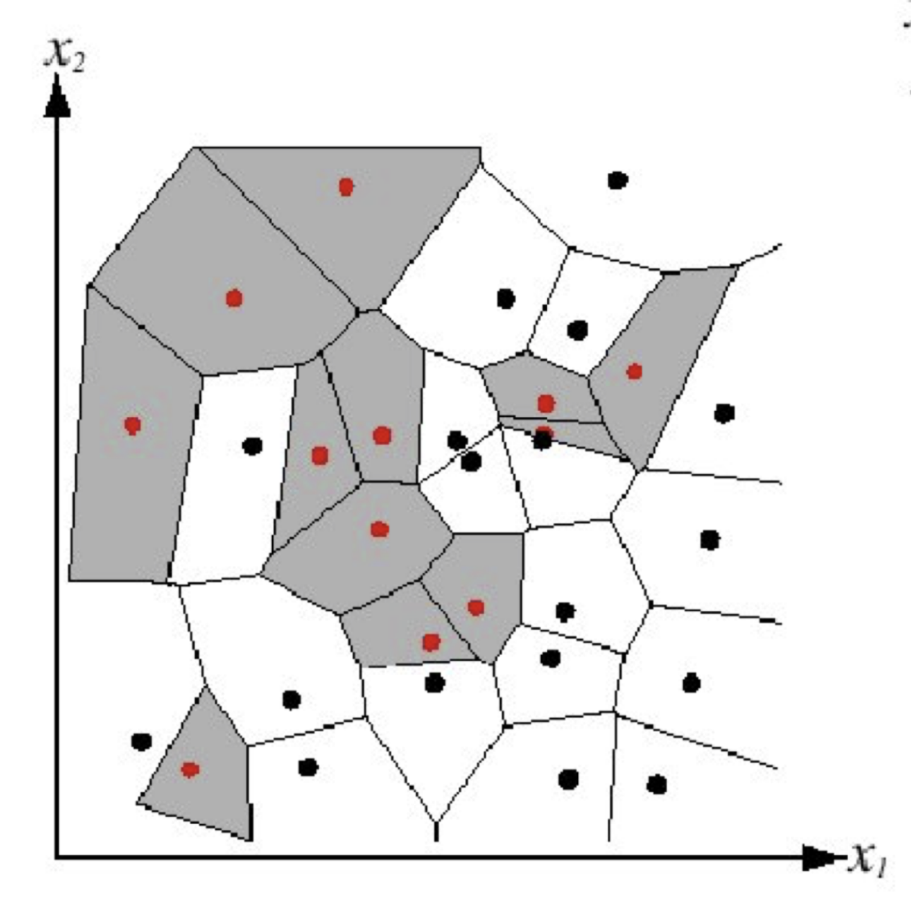
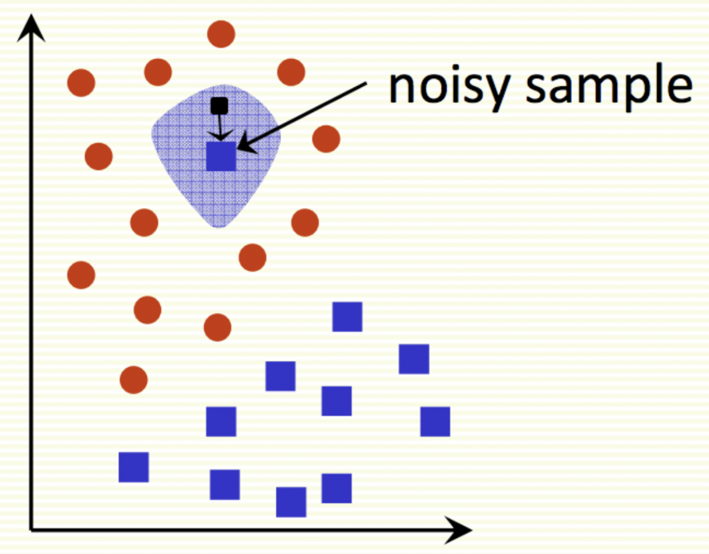

# Nearest neighbour methods

$$
\newcommand{\x}{\mathbf x}
\newcommand{\abs}[1]{\left\lvert #1 \right\rvert}
\DeclareMathOperator*{\argmin}{argmin}
$$

## Supervised learning

- input is **training set** consisting of **inputs** $\x$ and corresponding **labels** $t$
  - input usually represented as a vector in $\x \in \R^d$
    - **representation** is mapping data to a space that's easier to manipulate
    - vectors allow us to use linear algebra
  - $t$ can be
    - real number (regression)
    - an element of a discrete set (classification)
    - highly structured data

## Nearest neighbours (NN)

Can classify $\x$ by finding the input vector in the training set that is closest to $\x$ and using the same label

- "closest" can be measured using Euclidean distance between vectors

### Algorithm

$$
\x^* = \argmin_{\mathbf p \in \text{training set}} \abs{x - p} \\
\text{output } y = t^*
$$

Classification and decision boundaries correspond to voronoi diagram

## kNN

- NN is sensitive to noise/mislabeled data ("class noise")
  - 
- can smooth it by getting "votes" from $k$ nearest neighbours instead of just 1

### Algorithm

- get $k$ closest input examples $(\x^*, t^*)$ to $\x$
- output is class that shows up the most in those $k$ examples

### Choosing $k$ - hyperparameter tuning

- small $k$ is good at capturing fine-grained patterns
  - may overfit - be sensitive to noise
- large $k$ makes stable predictions
  - may underfit - fail to capture details

